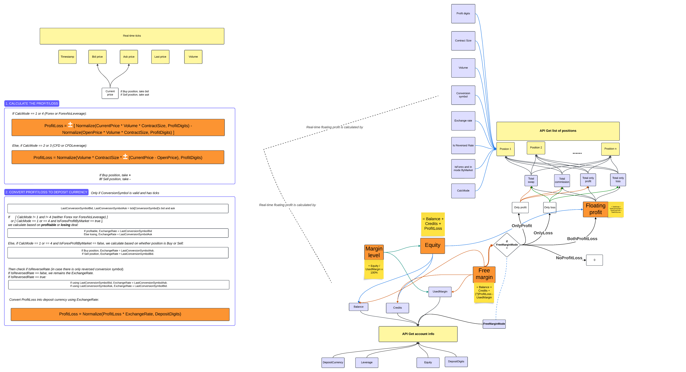

# Real-Time Trading PnL & Margin Calculation Demo

This repository demonstrates how to calculate trading metrics in real time, including:

- Profit & Loss (PnL)
- Equity
- Free Margin
- Margin Level
- Based on open positions and incoming price ticks

Useful for simulating or visualizing trading logic and behavior.

